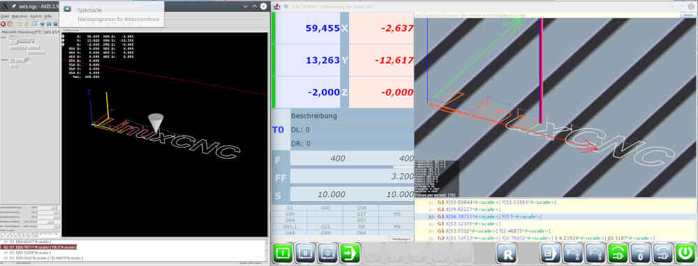
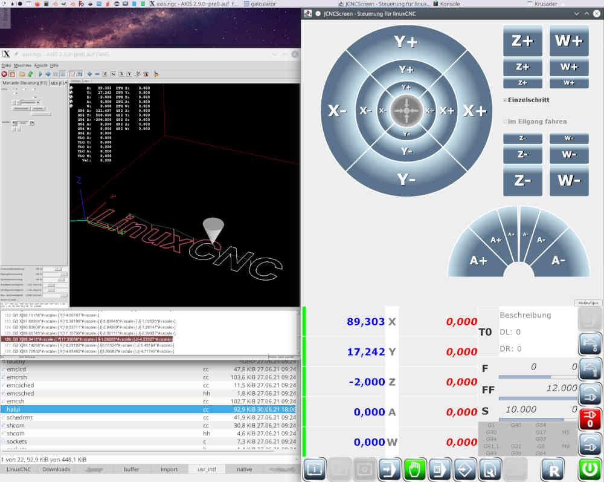
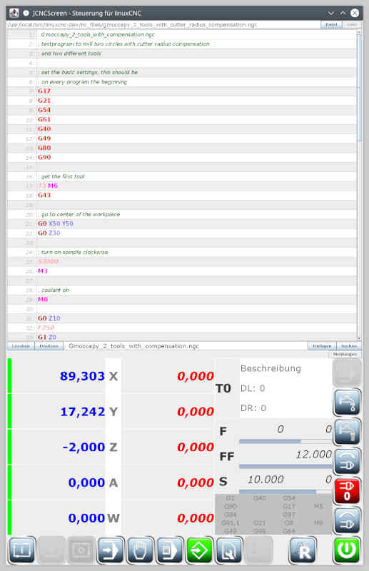
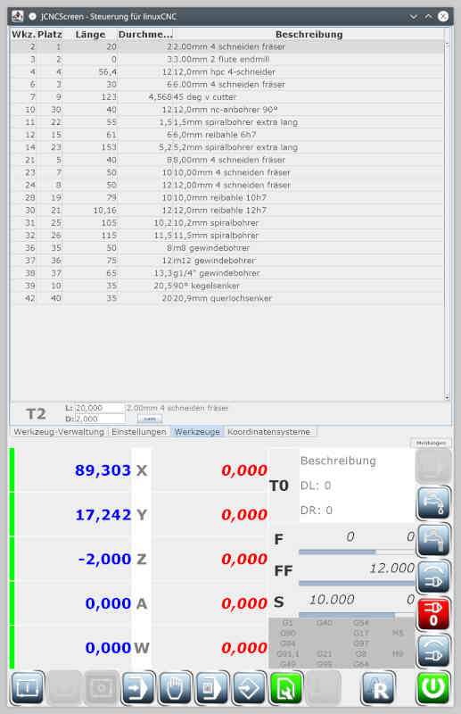

# JCNCScreen
## Features
* _JCNCScreen_ is a frontend application for [linuxcnc](http://linuxcnc.org) which
  is published according to GPL 2.0 or later. See file COPYING for details.

* _JCNCScreen_ contains a tool-manager with plugins for exporting tooltables for
  different applications. These Plugins are separate projects.

* _JCNCScreen_ supports up to 9 axis. Screen controls reflect settings from
  linuxcnc inifile.

* _JCNCScreen_ is build with java-language and swing for gui, so building and
  installing might be different to usual linux packages.

* Running _JCNCScreen_ might be different for java applications, as linuxcnc
  uses shared memory buffers for communication. So _JCNCScreen_ contains a
  little C-stub that handles all shared memory access. That stub needs to be
  loaded by the java runtime, so starting _JCNCScreen_ needs special parameters.

## Screenshots
[](doc/LC_Test01.jpg)

[](doc/LC_Jog01.jpg)

[](doc/LC_GCedit01.jpg)

[](doc/LC_TT01.jpg)

## Build
* All Projects must reside in parallel directories, i.e. like this:
  ```
  /usr/local/src
             |-  JCNCScreen              (mandatory)
             |-  LCExportHandler         (mandatory)
             |-  LinuxCNCExportHandler   (optional)
             |-  CamBamExportHandler     (optional)
             +-  SRExportHandler         (optional)
  ```
* subproject _LCExportHandler_ should be build first.
  But before building it, _JCNCScreen_ should already have been downloaded.
  Dive into the projects directory and call
  ```
  ant dist
  ```
  That will build the library and copy it into the lib directory of _JCNCScreen_.

* Next step is to build _JCNCScreen_.
  As already mentioned, _JCNCScreen_ consists of two parts, the java components
  and the C-stub. To compile the C-Stub you need a development installation of
  linuxcnc. Best is a RIP-installation.
  Go into the directory **native** from _JCNCScreen_ and add a softlink
  to **linuxcnc** like this:
  ```
  ln -s /usr/local/src/linuxcnc.git lc
  ```
  Change the path of linuxcnc to your corresponding location.
  Be sure, that you have already built linuxcnc successfully.

  Now you can build _JCNCScreen_. Go to the main directory of _JCNCScreen_
  and call
  ```
  ant dist
  ```
  That will compile the C-stub and the java application.
  On successful build, you find a zip-file **JCNCScreen-bin.zip** in the main
  directory of _JCNCScreen_. That archive contains everything to run _JCNCScreen_
  from where ever you want.

## Run the app
* Extract the archive to the wanted location, move into it and create the same
  softlink to linuxcnc installation as before from directory **native**.

* Then look at subdirectory **misc** - it contains a little bash-script for
  application startup.
  Edit the file and change the path from first line to the directory, where you
  extracted the binary archive. Then copy the script to a directory that is
  contained in your PATH environment variable (i.e. /usr/local/bin).

* Finally you have to tell _linuxcnc_, that you want to use _JCNCScreen_
  as frontend. Edit the ini-file for your machine and search the DISPLAY
  variable from DISPLAY section.
  Change it to JCNCScreen and you're done.

  DISPLAY section of inifile should look like this:
  ```
  [DISPLAY]
  #DISPLAY = axis
  DISPLAY = JCNCScreen
  ```

## Usage
* find a user manual in subdirectory **doc**


Have fun!

